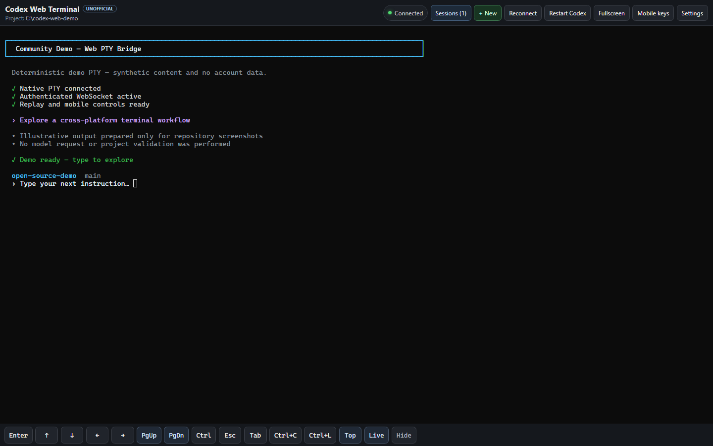
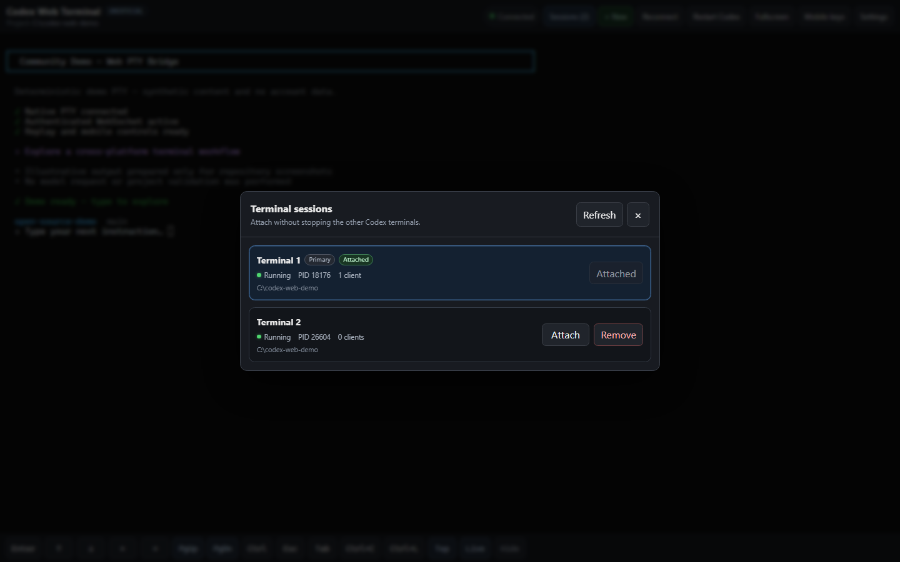
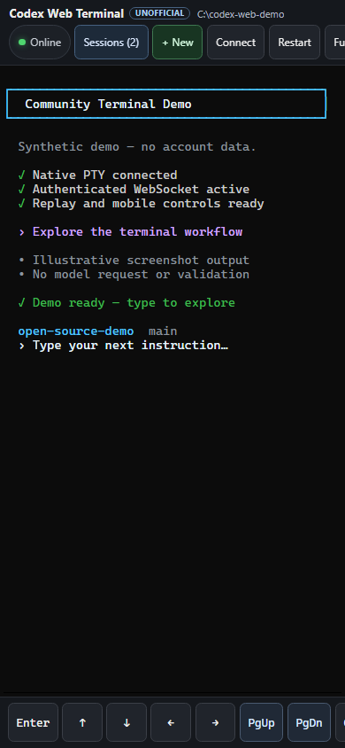

# Codex Web Terminal

[](https://github.com/bproject07/Codex-web/actions/workflows/ci.yml)
[](LICENSE)
[](BUILDING.md)

**Unlike structured remote-control interfaces, Codex Web Terminal provides
full, self-hosted access to the real Codex CLI experience directly from any
desktop or mobile browser.**

Codex Web Terminal runs the **real Codex CLI, Claude Code, or Google
Antigravity CLI (`agy`)** in a native pseudo-terminal (ConPTY on Windows, a
Unix PTY on Linux and macOS) and exposes that terminal to a browser through an
authenticated WebSocket. It does not reimplement or scrape an agent
interface. ANSI output, cursor movement, menus, approval prompts, diffs,
spinners, keyboard input, and the rest of each TUI are interpreted by xterm.js
from the original PTY byte stream.

The project is an independent wrapper. It does not download, vendor, modify,
or silently install or update any agent CLI.

> [!IMPORTANT]
> This is an independent, unofficial community project. It is not affiliated
> with, sponsored by, or endorsed by OpenAI, Anthropic, or Google. Agent CLIs
> are installed separately and are not included in this repository.

> **This application provides remote terminal access.**
> **Do not expose it directly to the public internet.**

## Screenshots

### Desktop terminal



### Session manager



### Mobile terminal



All screenshots are generated from the repository's deterministic demo PTY.
They contain synthetic terminal text only—no live Codex conversation, model
output, credentials, tokens, account or company names, personal paths, or
private host data. See [the screenshot guide](docs/screenshots/README.md) for
the reproducible capture procedure.

## Documentation

- [BUILDING.md](BUILDING.md) — complete Windows and Linux prerequisites,
  validation, build, package, and troubleshooting instructions
- [OPERATIONS.md](OPERATIONS.md) — startup, tokens, browser controls,
  Tailscale, services, monitoring, shutdown, and upgrades
- [AGENTS.md](AGENTS.md) — repository map, invariants, test matrix, and
  definition of done for coding agents
- [TODO.md](TODO.md) — deliberately unimplemented ideas and their safety
  requirements
- [CONTRIBUTING.md](CONTRIBUTING.md) — contribution workflow and required
  cross-platform validation
- [SECURITY.md](SECURITY.md) — supported versions and private vulnerability
  reporting
- [CODE_OF_CONDUCT.md](CODE_OF_CONDUCT.md) — community expectations
- [THIRD_PARTY_NOTICES.md](THIRD_PARTY_NOTICES.md) — dependency licensing and
  attribution

## Architecture

```text
Desktop or mobile browser
  React + xterm.js
          │
          │ authenticated HTTP + WebSocket
          │ binary terminal bytes / JSON control messages
          ▼
Rust server
  Tokio + Axum
      ├── authenticated directory browser ── server-account filesystem
      ├── Favorites / Recent store ───────── workspaces.json
      ├── supervised peer broker ──────────── in-memory threads and turns
      └── managed session registry (20 by default, configurable)
                          │
                          ▼
                   Native PTY sessions
                    ├── Windows: resolved .exe or .cmd
                    └── Unix: resolved executable
                          │
                          ▼
               Codex, Claude, or AGY
               in each selected folder
```

The server owns up to 20 independent, web-managed agent PTY sessions by
default. The operator can select a limit from 1 through 256. The browser
displays one selected session in the same xterm screen and can switch between
them without terminating the others. Closing the browser page/window or losing
the network does not terminate those sessions; using a terminal tab's explicit
× action does. A reconnecting browser resets xterm and replays the selected
session's bounded terminal output buffer before it resumes live output.

## Current scope

- 20 persistent, web-managed session entries per server by default,
  configurable from 1 through 256; each running entry owns one agent process
- One primary agent session, started automatically
- Read-only discovery of Codex, Claude, and AGY with installed version and
  `ready`, `missing`, or `misconfigured` status
- Up to four authenticated WebSocket clients per terminal session
- A canonicalized default project directory selected when the server starts
- Per-session working-folder selection from server-side Favorites, Recent,
  filesystem roots, one-level directory browsing, or a manual absolute path
- Server-side persistence for up to 100 Favorites and 30 deduplicated Recent
  folders
- Supervised `@cwt` handoff, independent review, return, and same-reviewer
  `Recheck` between Codex, Claude, and AGY sessions
- A fresh dedicated reviewer PTY for every new peer thread; ordinary sessions
  are never selected or reused as reviewers
- One 16 MiB bounded raw terminal output buffer per session
- Up to the newest 2 MiB replayed to each newly attached client
- Initial PTY size of 120 columns by 35 rows
- Validated browser resize range: 20–500 columns and 5–300 rows
- Windows 10/11 and x86_64 Linux are tested platforms
- Linux runtime validation currently covers Arch Linux
- No built-in TLS, reverse proxy, or tunnel

Clients attached to the same terminal session share its PTY and can type into
it concurrently. They also share its PTY dimensions, so the most recent valid
resize from any attached browser wins. The authenticated URL grants full
read/write control over every managed session plus folder browsing and launch
authority anywhere readable by the server account. Do not share it with
anyone who should not have that access.

## Download a prebuilt release

Tagged releases are designed to provide two self-contained application
archives from the repository's
[GitHub Releases](https://github.com/bproject07/Codex-web/releases) page:

- `codex-web-terminal-vX.Y.Z-windows-x86_64.zip`
- `codex-web-terminal-vX.Y.Z-linux-x86_64-glibc.tar.gz`

Each archive contains the native server executable, the adjacent `web`
directory, documentation, and a generated target-specific
`THIRD_PARTY_LICENSES` bundle. It also contains `release-package.json`, the
target/version marker required by the built-in updater. `SHA256SUMS.txt` and
GitHub artifact provenance are attached to the same release. If the Releases
page has no tagged version yet, use the source-build instructions below; do
not download binaries from an unofficial mirror.

Verify a downloaded archive before extracting it:

```bash
grep -F '  codex-web-terminal-vX.Y.Z-linux-x86_64-glibc.tar.gz' \
  SHA256SUMS.txt | sha256sum -c -
gh attestation verify \
  --repo bproject07/Codex-web \
  --signer-workflow bproject07/Codex-web/.github/workflows/release.yml \
  codex-web-terminal-vX.Y.Z-linux-x86_64-glibc.tar.gz
```

On Windows, use `Get-FileHash -Algorithm SHA256` and compare the result with
`SHA256SUMS.txt`; use the same repository and
`--signer-workflow bproject07/Codex-web/.github/workflows/release.yml` when
verifying the ZIP attestation. Release archives are not Authenticode-signed
yet, so Windows SmartScreen may show an unknown-publisher warning. Verify both
the checksum and GitHub attestation before deciding whether to run an unsigned
build.

After extraction, keep `web` next to the executable and start it directly:

Windows:

```powershell
.\codex-web.exe --project "C:\Projects\my-app"
```

Linux:

```bash
./codex-web --project "/home/user/projects/my-app" --no-open-browser
```

The Linux archive is built on Ubuntu 22.04 for x86_64 GNU/Linux and targets a
glibc 2.35-or-newer runtime. It is not a universal Linux or musl binary.

### Automatic application updates

An official portable package checks the official
`bproject07/Codex-web` GitHub Releases feed shortly after startup and at most
once every 24 hours. Settings shows the installed/latest versions and a badge
when a newer stable release is available. Checking is read-only. Installation
requires the operator to tick the session-termination confirmation and choose
**Update to X.Y.Z and restart**; there is no silent restart.

The updater accepts only the exact Windows or Linux asset for the running
target. It requires a published, stable, immutable GitHub Release, matches the
GitHub asset SHA-256 metadata with the downloaded bytes and
`SHA256SUMS.txt`, rejects unsafe archive paths/links/special files, validates
`release-package.json`, the PE/ELF architecture, the complete web/license
layout, and the staged binary version. The verified package is installed
side-by-side under the dedicated state directory. The old executable is never
overwritten.

The executable from the manually installed v0.2 package is the stable
bootstrap and root supervisor. It may serve v0.2 directly until the first
built-in update. During that update it remains alive under the same process ID,
starts the verified package as a supervised worker, and becomes the sole
supervisor for every later worker generation. Workers never create another
supervisor. A later worker persists a matching bounded `pending.json` before
initiating orderly shutdown, then requests the transition with its reserved
exit status. The record contains only the request ID, source version, and
target version—never a path, URL, command, checksum, or token.

The candidate receives the existing token only through `CODEX_WEB_TOKEN`, not
argv or update state, and consumes/removes that inherited variable before
starting application threads. The root also supplies a fresh per-launch
readiness nonce through the private worker environment; the worker consumes
that variable and returns the value only in its authenticated health response.
The candidate must bind the same port and pass direct authenticated local
health, with system proxies disabled, using the expected `serverVersion` and
nonce. Only then does the root atomically commit
`active.json` with the active and exact previous versions. On failure, the
candidate is terminated and waited for, the pointer remains unchanged, and the
root starts the exact prior executable and requires it to become ready before
supervision continues.

Updating terminates all PTYs and in-memory `@cwt` threads. It preserves the
same effective server settings, authentication token, port, project,
Favorites, and Recent state for the controlled restart. The browser waits for
the expected server version and reloads. If the browser has blocked
`sessionStorage`, that one same-origin reload carries the token in the query
string and removes it from the visible address again as soon as the frontend
starts. Keep enough free space for the download, extraction, current release,
and one rollback release.

Only GitHub release packages carry the required marker. `dist`, `dist-linux`,
`cargo run`, and locally modified/source-built packages can check and link to a
new release but deliberately cannot self-install it. The move from v0.1 to
v0.2 must therefore be performed manually once using the complete archive.
Keep that manually installed v0.2 package: a service continues to start its
bootstrap executable even after newer workers are active under
`<state-dir>/updates/releases`. Built-in cleanup must not delete it. A future
change to the supervisor/security protocol may explicitly require another
manual full-archive launcher replacement. Set `--update-policy off` when
update checks are not allowed or the host has no outbound GitHub access.

## Prerequisites

Prebuilt archives require only a supported operating system, browser, and at
least one separately installed agent CLI. Rust, Node.js, compilers, and the
source tree are required only when building from source.

### Windows

- Windows 10 version 1809 or newer, or Windows 11, for ConPTY
- PowerShell 5.1 or newer
- A supported browser: current Chrome, Edge, Firefox, or Safari on mobile

### Linux

- A current x86_64 Linux distribution with standard Unix PTY support
- GCC or Clang and the normal native build tools required by Rust
- A supported browser on the client device

### Rust (source builds only)

Install stable Rust from [rustup.rs](https://rustup.rs/).

The recommended Windows target is MSVC. Install Visual Studio Build Tools with
the **Desktop development with C++** workload. Run builds from Developer
PowerShell when `link.exe` is not already in `PATH`.

The build script can also use an installed `x86_64-pc-windows-gnu` Rust
toolchain when MinGW `gcc.exe` is available.

Verify:

```powershell
rustc --version
cargo --version
```

### Node.js (source builds only)

Install a Vite-supported Node.js release: Node 20.19 or newer within the Node
20 line, or Node 22.12 or newer. Then verify:

```powershell
node --version
npm --version
```

### Agent CLIs

Install at least the primary CLI on the machine that will run `codex-web`.
Codex Web Terminal detects Codex, Claude Code, and AGY in the server account's
`PATH` and documented per-user install locations. Detection runs only each
CLI's `--version` command; it never installs software or starts a login flow.

Official native install commands:

| CLI | Windows PowerShell | Linux/macOS |
| --- | --- | --- |
| Codex | `powershell -ExecutionPolicy ByPass -c "irm https://chatgpt.com/codex/install.ps1 \| iex"` | `curl -fsSL https://chatgpt.com/codex/install.sh \| sh` |
| Claude Code | `irm https://claude.ai/install.ps1 \| iex` | `curl -fsSL https://claude.ai/install.sh \| bash` |
| AGY | `irm https://antigravity.google/cli/install.ps1 \| iex` | `curl -fsSL https://antigravity.google/cli/install.sh \| bash` |

Review the current upstream instructions before executing downloaded scripts:
[Codex CLI](https://learn.chatgpt.com/docs/codex/cli),
[Claude Code](https://code.claude.com/docs/en/setup), and
[Antigravity CLI](https://antigravity.google/docs/cli/install).

Verify and authenticate each CLI directly on the server host:

```text
codex --version
claude --version
agy --version
```

Run `codex login`, `claude`, or `agy` once when that CLI requires interactive
authentication. Codex Web Terminal neither copies nor reads agent credentials.
Each child inherits the server account's environment and existing CLI
configuration.

The browser shows missing or misconfigured agents together with an official
manual command and verification command. Run the command in a trusted terminal
on the **server host**, then choose **Refresh** or **Check again**. There is
deliberately no silent browser installation: installing a host executable is
a security-sensitive operator action and may require interactive review,
authentication, package-manager policy, or elevation.

## Quick start from source

From the repository root:

Windows:

```powershell
.\scripts\build.ps1
.\scripts\run.ps1 -Project "C:\Projects\my-app"
```

Linux:

```bash
./scripts/build.sh
./scripts/run.sh "/path/to/my-app" --no-open-browser
```

The server starts on `127.0.0.1:8787`, generates an ephemeral cryptographically
secure token, and prints an authenticated URL. When bound to an unspecified
address, it can print both local and discovered network URLs:

```text
Codex Web Terminal started

Local URL:
http://127.0.0.1:8787/?token=...
```

Open that URL. The frontend normally moves the token into `sessionStorage` and
removes it from the visible address. The token is not put in `localStorage`.
If hardened browser settings reject tab storage, the current page keeps the
token only in memory; the controlled update reload uses the same one-navigation
fallback described above.

Use the session tabs in the header to switch between managed terminals and
**+ New** to create another live agent PTY. **+ New** first opens **Choose a
project folder**:

- **Favorites** contains folders explicitly starred in the browser UI.
- **Recent** contains folders in which a terminal successfully started, newest
  first.
- **Browse** shows filesystem roots and one directory level at a time. It
  never lists files. A full, absolute path on the server can also be opened
  manually.

After **Use folder**, **New terminal** shows the detected Codex, Claude, and
AGY status and installed version; choose a ready agent to start it in that
folder. A Favorite with a remembered preferred agent or a Recent entry with
its last agent also provides a direct **Start Codex**, **Start Claude**, or
**Start AGY** shortcut. If that agent is no longer ready, the normal agent
picker opens instead.

Every open of **+ New** forces a fresh server-side agent check so an older
browser tab cannot reuse stale availability. A missing or misconfigured agent
displays manual host-side installation guidance and **Refresh** /
**Check again** actions. Swipe the tab strip on mobile, or use a wheel,
trackpad, or the overflow arrows on desktop. **Manage** opens the detailed
session list and shows the current/configured count, for example `3/20`.
**+ New** is disabled at capacity; existing `@cwt` follow-ups remain available
because they reuse their dedicated reviewer. Switching tabs does not stop the
previously displayed session; it continues running and buffering output in
the background.

### `@cwt` peer review

The header's **@cwt** button opens a separate peer composer. It intentionally
does not intercept text typed into xterm, so raw terminal input and Android
IME handling remain unchanged.

1. Select **Review**, **Verify**, **Ask**, or **Handoff**, choose an installed
   agent kind, describe the scope, and use **Source ready — Prepare handoff**
   only while the source is at an empty agent prompt.
2. The server creates a fresh dedicated reviewer PTY in the source session's
   revalidated working directory. It never selects an existing ordinary tab.
   Catalog **Ready** proves executable discovery and a bounded version probe
   only; complete any first-run sign-in or folder-trust prompt in the linked
   reviewer tab yourself.
3. The source agent prepares a bounded Markdown handoff through a private
   local bridge. The browser shows it for review and optional editing.
4. **Reviewer ready — Send** releases the approved handoff after the dedicated
   reviewer is at an empty agent prompt.
5. When the response is ready, **Source ready — Return** asks the source agent
   to retrieve it and present the useful conclusion in its existing context.
6. A later **Recheck** or follow-up uses the same live reviewer PTY. **+ New
   peer** always creates a clean reviewer context.

A new reviewer also consumes one session slot, so **+ New peer** is disabled
when the configured capacity is full. Existing follow-ups remain enabled
because they reuse their reviewer. The broker retains at most 32 turns in one
reviewer thread; after that, close it and start a clean peer conversation.
Active in-memory peer threads are bounded by the server's supported maximum of
256, while the configured session capacity is normally the tighter limit.

For example, open **@cwt** from a Codex source tab, choose **Verify** and
Claude, then enter: `Review the current implementation for correctness,
security regressions, and missing Windows/Linux tests.` The source prepares
the handoff; you inspect it before sending. After Claude submits its bounded
response, **Source ready — Return** brings the result back to that exact Codex
conversation. A later **Recheck** keeps Claude's reviewer context; **+ New
peer** deliberately starts without it.

Peer and ordinary non-primary tabs have an accessible `×`. Closing a peer tab
terminates only its dedicated PTY and purges its in-memory thread. A reviewer
uses one slot from the configured session capacity; the server never evicts
another tab.
Restart, terminate, and removal of a source are blocked while it owns an open
peer thread because those operations would make the retained context
ambiguous.

The bridge listens only on an ephemeral loopback port. Every PTY generation
gets a random, narrowly scoped capability that is revoked when that generation
ends. The browser token is never given to the helper and `CODEX_WEB_TOKEN` is
removed from managed PTY and version-probe environments. Shutdown disables
capability activation before releasing the private listener; an unexpected
bridge exit shuts the public service down. Handoffs and responses are limited
to 64 KiB, retained only in server memory, excluded from logs, and never
extracted from ANSI/xterm output. Line endings are normalized and terminal
control characters are rejected before storage and again before the helper
writes an artifact.

This is supervised coordination, not an autonomous scheduler. Generic CLI
TUIs expose no reliable cross-provider "idle" signal, so Preview, Send, Return,
and retry decisions stay explicit. The readiness-labelled buttons are the
operator's acknowledgement; the matching API requests require
`sourceReady: true` or `reviewerReady: true`. Delivery is bound to the exact
PTY `sessionId` generation, but the server intentionally does not guess
whether a CLI is showing its normal prompt, a confirmation, or first-run
setup. If an agent declines the helper command or its tool policy blocks it,
the UI remains at the current visible state instead of guessing from terminal
output.

Automation prompt text and its Enter submit key are one ordered queue
transaction but use separate PTY writes with a short settle interval. This
prevents paste-burst guards from treating Enter as part of a fast pasted prompt
while still preventing browser input from interleaving between the two writes.

The generated token changes whenever the server restarts. Supply `--token` or
`CODEX_WEB_TOKEN` when a stable token is required.

## Development

Use two terminals.

Terminal 1:

```powershell
cd server
cargo run -- --project "C:\Projects\my-app" --no-open-browser
```

On Linux, the equivalent command is:

```bash
cd server
cargo run -- --project "/path/to/my-app" --no-open-browser
```

Terminal 2:

```text
cd web
npm install
npm run dev
```

Open the Vite URL, adding the token printed by the Rust server:

```text
http://127.0.0.1:5173/?token=TOKEN_FROM_SERVER
```

Vite proxies `/api` and `/ws` to `127.0.0.1:8787`. The backend explicitly
allows loopback development origins on another port.

If the active Rust toolchain is MSVC but Visual C++ is unavailable, use a
configured GNU toolchain for local validation:

```powershell
$gnuToolchainLine = rustup toolchain list |
  Where-Object { $_ -match "x86_64-pc-windows-gnu" } |
  Select-Object -First 1
if (-not $gnuToolchainLine) {
  throw "Install an x86_64-pc-windows-gnu Rust toolchain first."
}
$gnuToolchain = ($gnuToolchainLine -split "\s+")[0]

rustup run $gnuToolchain cargo run -- `
  --project "C:\Projects\my-app" `
  --no-open-browser
```

The command derives the exact installed GNU toolchain name instead of assuming
that it is named `stable`.

## Production build

The reproducible manual workflow is the same on every platform:

```text
cd web
npm ci
npm run build

cd ../server
cargo build --release --locked
```

On Windows, the convenience build script is:

```powershell
.\scripts\build.ps1
```

On Linux:

```bash
./scripts/build.sh
```

The scripts check the required tools, build both applications, and create:

```text
dist/                    # Windows
├── codex-web.exe
├── web/
│   ├── index.html
│   └── assets/
├── README.md
├── BUILDING.md
├── OPERATIONS.md
├── AGENTS.md
├── TODO.md
├── CONTRIBUTING.md
├── SECURITY.md
├── CODE_OF_CONDUCT.md
├── THIRD_PARTY_NOTICES.md
├── docs/
│   └── screenshots/
└── LICENSE

dist-linux/              # Linux
├── codex-web
├── web/
│   ├── index.html
│   └── assets/
├── README.md
├── BUILDING.md
├── OPERATIONS.md
├── AGENTS.md
├── TODO.md
├── CONTRIBUTING.md
├── SECURITY.md
├── CODE_OF_CONDUCT.md
├── THIRD_PARTY_NOTICES.md
├── docs/
│   └── screenshots/
└── LICENSE
```

Keep the `web` directory next to `codex-web.exe`. The executable serves those
assets. A Linux package uses the same layout with the extensionless
`codex-web` binary. During `cargo run`, the backend also looks for `web/dist`.

The local build scripts do not create a redistribution license bundle. Before
sharing either directory, run the target-specific license generator described
in [BUILDING.md](BUILDING.md) and include its `THIRD_PARTY_LICENSES` directory.
Tagged GitHub Releases perform and verify that step automatically.

## Command-line interface

```powershell
.\dist\codex-web.exe --help
.\dist\codex-web.exe --version
```

On Linux:

```bash
./server/target/release/codex-web --help
./server/target/release/codex-web --version
```

Local example:

```powershell
.\dist\codex-web.exe `
  --project "C:\Projects\my-app" `
  --host 127.0.0.1 `
  --port 8787 `
  --shell powershell `
  --command codex
```

Tailscale example using the machine's exact Tailscale IP:

```powershell
$env:CODEX_WEB_TOKEN = "generate-and-paste-a-long-random-token"
$tailscaleIp = (tailscale ip -4 | Select-Object -First 1).Trim()
.\dist\codex-web.exe `
  --project "C:\Projects\my-app" `
  --host $tailscaleIp `
  --port 8787
```

Supported arguments:

| Argument | Purpose |
| --- | --- |
| `--host` | Bind address; defaults to `127.0.0.1` |
| `--port` | TCP port; defaults to `8787` |
| `--max-sessions` | Managed capacity including the primary entry, stopped entries, and `@cwt` reviewers; defaults to `20`, valid range `1`–`256` |
| `--project` | Default working directory for the primary terminal and new sessions that omit a folder |
| `--state-dir` | Dedicated directory for server-side Favorites and Recent state; uses the per-user OS default when omitted |
| `--shell` | Windows-only: `powershell` or `cmd`; ignored on Unix |
| `--command` | Explicit executable override for the primary terminal |
| `--primary-agent` | Agent represented by `--command`: `codex`, `claude`, or `agy`; defaults to `codex` |
| `--new-session-command` | Optional executable used when **New** starts the primary agent; defaults to the resolved primary command |
| `--codex-command` | Explicit Codex CLI executable override |
| `--claude-command` | Explicit Claude Code executable override |
| `--claude-dangerously-skip-permissions` | Launch Claude with `--dangerously-skip-permissions` |
| `--agy-command` | Explicit Google Antigravity CLI executable override |
| `--agy-dangerously-skip-permissions` | Launch AGY with `--dangerously-skip-permissions` |
| `--no-agent-auto-detect` | Disable automatic discovery of optional agent CLIs |
| `--token` | Authentication token, minimum 16 characters |
| `--no-open-browser` | Do not launch the default browser |
| `--log-level` | tracing filter such as `info` or `debug` |
| `--update-policy` | Official application release checks: `notify` (default) or `off`; never enables silent installation |

Command values are treated as executable names or file paths, not as arbitrary
shell expressions. A discovered `.cmd` entry point is always invoked through
`cmd.exe /d /s /c` on Windows, which is required for the npm Codex package. On
Unix, the resolved executable is launched directly without a shell wrapper.
The two permission switches add one fixed argument to the selected process.
On Unix and Windows `cmd` launches it remains a distinct process argument. The
Windows PowerShell wrapper encodes it as a single-quoted literal with embedded
quotes escaped. It cannot be selected or altered by a browser client.

With auto-detection enabled (the default), the primary executable name follows
`--primary-agent`, and the server probes `codex`, `claude`, and `agy` plus
their documented per-user locations. An explicit `--command`,
`--codex-command`, `--claude-command`, or `--agy-command` is authoritative: a
typo or broken path is reported as `misconfigured` and never falls back
silently. Use
`--no-agent-auto-detect` when deployment policy requires optional agents to
have explicit profiles. The primary profile is still resolved and validated.

`--new-session-command` is useful when the primary terminal uses a wrapper
that resumes a specific Codex thread. For example, start the primary with that
trusted wrapper and pass `--new-session-command codex` so **New** always opens
an independent Codex session when the Codex (primary-agent) card is selected.
Claude and AGY cards continue to use their own override or default command.

Normally no additional flags are needed to expose installed CLIs. Explicit
paths are useful for services with a restricted `PATH`:

```powershell
.\dist\codex-web.exe `
  --project "C:\Projects\my-app" `
  --command codex `
  --claude-command "$HOME\.local\bin\claude.exe" `
  --agy-command "$env:LOCALAPPDATA\agy\bin\agy.exe"
```

Add the following switches only in a trusted, isolated environment when every
tool action should run without a permission prompt:

```text
--claude-dangerously-skip-permissions
--agy-dangerously-skip-permissions
```

They launch `claude --dangerously-skip-permissions` and
`agy --dangerously-skip-permissions`, respectively. Both upstream CLIs warn
that this bypasses their normal safety confirmations. The similar Claude flag
`--allow-dangerously-skip-permissions` merely makes bypass mode available; it
does not enable bypass mode at startup.

## Environment variables

CLI arguments override environment variables.

| Variable | Default |
| --- | --- |
| `CODEX_WEB_HOST` | `127.0.0.1` |
| `CODEX_WEB_PORT` | `8787` |
| `CODEX_WEB_MAX_SESSIONS` | `20`; valid range `1`–`256` |
| `CODEX_WEB_PROJECT_DIR` | Current directory |
| `CODEX_WEB_STATE_DIR` | Windows: `%LOCALAPPDATA%\codex-web-terminal`; Unix: `$XDG_STATE_HOME/codex-web-terminal` or `$HOME/.local/state/codex-web-terminal` |
| `CODEX_WEB_TOKEN` | Secure random token generated at startup |
| `CODEX_WEB_COMMAND` | Unset; derived from `CODEX_WEB_PRIMARY_AGENT` |
| `CODEX_WEB_PRIMARY_AGENT` | `codex` |
| `CODEX_WEB_NEW_SESSION_COMMAND` | Unset; uses the resolved primary command |
| `CODEX_WEB_CODEX_COMMAND` | Unset; auto-detects `codex` |
| `CODEX_WEB_CLAUDE_COMMAND` | Unset; auto-detects `claude` |
| `CODEX_WEB_CLAUDE_DANGEROUSLY_SKIP_PERMISSIONS` | `false` |
| `CODEX_WEB_AGY_COMMAND` | Unset; auto-detects `agy` |
| `CODEX_WEB_AGY_DANGEROUSLY_SKIP_PERMISSIONS` | `false` |
| `CODEX_WEB_NO_AGENT_AUTO_DETECT` | `false` |
| `CODEX_WEB_SHELL` | `powershell`; Windows-only and ignored on Unix |
| `CODEX_WEB_LOG_LEVEL` | `info` |
| `CODEX_WEB_UPDATE_POLICY` | `notify`; set `off` to disable official application release checks |

The default project directory is canonicalized and checked at startup. The
primary terminal starts there. An authenticated **New** request may instead
select another absolute directory readable by the server account; that choice
applies only to the new managed terminal. `--project` is therefore a default,
not a filesystem allowlist or sandbox.

## Workspace state

Favorites and Recent are host- and operating-system-account-local. They are
stored by the server in `workspaces.json`, not in browser storage. The state
directory is selected by `--state-dir` or `CODEX_WEB_STATE_DIR`. When neither
is set, it is:

```text
Windows: %LOCALAPPDATA%\codex-web-terminal
         (with %USERPROFILE%\AppData\Local as a fallback)
Unix:   $XDG_STATE_HOME/codex-web-terminal
         or $HOME/.local/state/codex-web-terminal
```

A relative configured state directory is resolved from the server's startup
working directory. Writes use a temporary file in the same directory,
flush it, and atomically replace `workspaces.json`; Unix also syncs the parent
directory. The target must be a dedicated application subdirectory, not a
filesystem root, current directory, account/system base directory, or the
system temporary directory. State directories and files cannot be symlinks
or Windows reparse points.

On Unix, a newly created state directory uses mode `0700` and new state files
use `0600`. An existing directory or file must already be owned by the
effective server user and grant no group/other permissions; the application
rejects unsafe targets rather than changing their mode. Windows deployments
rely on operator-managed directory ACLs.
There is no cross-process locking or merge protocol. Give every concurrently
running server instance a distinct `--state-dir`; sharing one can lose updates
through last-writer-wins replacement.

The format is versioned as schema 1, the file is limited to 32 MiB
(33,554,432 bytes) on both read and write, Favorites to 100 entries, and
Recent to 30 entries. Recent is deduplicated by native directory and ordered
newest first. A successful primary startup, new-session launch, or restart
records the folder and actual agent; launching from an existing Favorite also
refreshes its preferred agent. Every PTY start revalidates that the stored path
is still the same canonical, readable directory. A stale or symlink-swapped
path rejects Restart before the running PTY is terminated. If persistence fails
after a PTY has started, the live terminal remains successful and the server
logs a warning. A Favorite mutation whose serialized state would exceed the
limit fails with HTTP 507 before replacing the current file or in-memory state.
If an existing file is malformed, larger than the limit, or uses an unsupported
version, the server renames it to
`workspaces.corrupt.<uuid>.json`, logs a warning without its contents, and
loads a clean schema-1 state. Normal successful primary startup may
immediately add the default folder to Recent. The quarantined file is
preserved for operator inspection; it is not overwritten.

Saved entries may outlive renamed, removed, or permission-restricted folders.
Favorites remain visible until explicitly updated or removed. Recent entries
remain until a successful launch refreshes them or enough newer launches evict
them; a failed attempt removes neither kind of entry. Browsing, starting, or
updating a Favorite always resolves and checks the directory again, so stale
state never bypasses filesystem permissions. The state file contains display
paths and reversible path IDs, so it can reveal filesystem layout and usage
history. Protect the live file and its backups, and exclude both from
screenshots and issue reports.

## HTTP API

All HTTP `/api` endpoints require:

```http
Authorization: Bearer YOUR_TOKEN
```

Endpoints:

| Method | Path | Purpose |
| --- | --- | --- |
| `GET` | `/api/health` | Server version plus aggregate installation, process, session/client counts, and configured `maxSessions` capacity |
| `GET` | `/api/update` | Read the in-memory official application update state; never performs host mutation |
| `POST` | `/api/update/check` | Check the fixed official GitHub release feed now |
| `POST` | `/api/update/apply` | Start verified side-by-side installation after exact-version and session-termination confirmation |
| `GET` | `/api/agents` | Compatibility list of configured, ready profiles available to **New** |
| `GET` | `/api/agent-catalog` | Read-only platform, status, version, verification, install, and update metadata |
| `GET` | `/api/filesystem/roots` | List the configured default directory and server filesystem roots |
| `POST` | `/api/filesystem/list` | List one directory level; body `{"directoryId":"..."}`, `{}`, or empty for the configured default |
| `POST` | `/api/filesystem/resolve` | Open an absolute server path; body `{"path":"/absolute/server/path"}` |
| `GET` | `/api/workspaces` | Read schema-1 Favorites and Recent state |
| `PUT` | `/api/workspaces/favorites` | Create or update a Favorite by directory ID |
| `DELETE` | `/api/workspaces/favorites/{favoriteId}` | Remove one Favorite record |
| `GET` | `/api/sessions` | List sanitized metadata for all managed sessions |
| `POST` | `/api/sessions` | Create a terminal; optional body fields are `agent` and `directoryId` only |
| `GET` | `/api/sessions/{terminalId}` | Get one managed session |
| `POST` | `/api/sessions/{terminalId}/restart` | Terminate and recreate one agent PTY |
| `POST` | `/api/sessions/{terminalId}/terminate` | Terminate one agent PTY without removing its entry |
| `DELETE` | `/api/sessions/{terminalId}` | Terminate and remove a non-primary session |
| `GET` | `/api/peer/threads` | List active supervised peer threads and their current bounded turn |
| `POST` | `/api/peer/threads` | Create a fresh dedicated reviewer for one running source terminal |
| `GET` | `/api/peer/threads/{threadId}` | Read one active peer thread |
| `POST` | `/api/peer/threads/{threadId}/turns` | Prepare a follow-up on the same live reviewer |
| `POST` | `/api/peer/threads/{threadId}/dispatch` | Approve and deliver the current handoff preview |
| `POST` | `/api/peer/threads/{threadId}/return` | Return a ready reviewer response to the source |
| `DELETE` | `/api/peer/threads/{threadId}` | Close the reviewer and purge the in-memory thread |
| `GET` | `/api/session` | Legacy alias for primary-session metadata |
| `POST` | `/api/session/restart` | Legacy alias for restarting the primary session |
| `POST` | `/api/session/terminate` | Legacy alias for terminating the primary session |
| `GET` | `/ws?token=...&terminalId=...` | Attach an authenticated WebSocket to one managed terminal |

Peer requests that enqueue an automation prompt require an explicit readiness
acknowledgement: create/follow-up/return bodies include `sourceReady: true`,
and dispatch includes `reviewerReady: true`. Callers must set it only after
the named terminal is visibly at an empty agent prompt.

No response contains the authentication token, terminal input, terminal
output, Codex credentials, or Codex authentication files.

The directory DTO is:

```json
{"id":"opaque-native-path-id","name":"my-app","path":"/srv/projects/my-app"}
```

`id` is a versioned, URL-safe encoding of the native absolute path: Windows
UTF-16 on Windows and native path bytes on Unix. Clients must treat it as
opaque and return it unchanged. It is not encrypted, signed, or an
authorization mechanism; the bearer token and server account permissions are
the security boundary.

`GET /api/filesystem/roots` returns:

```json
{
  "defaultDirectory": {"id":"...","name":"my-app","path":"/srv/projects/my-app"},
  "roots": [{"id":"...","name":"/","path":"/"}]
}
```

Both directory-opening endpoints return:

```json
{
  "current": {"id":"...","name":"projects","path":"/srv/projects"},
  "parentId": "...",
  "breadcrumbs": [{"id":"...","name":"/","path":"/"}],
  "directories": [{"id":"...","name":"my-app","path":"/srv/projects/my-app"}],
  "truncated": false
}
```

Only immediate child directories are returned, sorted by name; files and
recursive descendants are omitted. At most 10,000 directories are returned.
`truncated: true` tells the client to use a more specific manual absolute path
when a directory contains more.

`GET /api/workspaces` returns:

```json
{
  "version": 1,
  "favorites": [{
    "id": "favorite-uuid",
    "directoryId": "...",
    "name": "my-app",
    "path": "/srv/projects/my-app",
    "label": null,
    "preferredAgent": "codex"
  }],
  "recent": [{
    "directoryId": "...",
    "name": "my-app",
    "path": "/srv/projects/my-app",
    "lastAgent": "codex",
    "lastOpenedAt": 1785100000000
  }]
}
```

Favorite upsert accepts
`{"directoryId":"...","label":"optional","preferredAgent":"codex"}`; `label`
and `preferredAgent` may be omitted. It is a full upsert: omitted optional
fields are stored as `null`, so they clear previous values for the same
directory. The favorite URL uses the favorite record's UUID, not its directory
ID. Labels are trimmed, limited to 120 characters, and cannot contain CR, LF,
or NUL; an empty label becomes `null`. A new-session body can be
`{"agent":"claude","directoryId":"..."}`. Empty bodies and bodies with only
`agent` remain compatible and use the configured default directory. Unknown
fields, including browser-supplied commands or arguments, are rejected.
JSON bodies for session creation, directory list/resolve, and Favorite upsert
are capped at 256 KiB; larger requests return HTTP 413.

`/api/agent-catalog` uses schema version 1 and reports each known agent as
`ready`, `missing`, or `misconfigured`. The `configuration` field is `auto` or
`override`, so a broken authoritative override can be repaired instead of
mistaken for a missing installation. Install metadata is an allowlisted
operator hint for the server operating system: it includes a shell, command,
verification command, update command, official documentation URL, and
`requiresServerAccess: true`. Fetching the catalog or pressing **Refresh** /
**Check again**
performs detection only. No API endpoint executes that command.

Each session snapshot contains a stable `terminalId`, display `name`, `agent`,
`isPrimary`, `createdAt`, the display `project` path, and its opaque
`directoryId`. The existing `sessionId` identifies the current PTY generation
and therefore changes when that terminal is restarted. `purpose` is
`{"kind":"interactive"}` for ordinary and primary sessions. A dedicated
reviewer reports
`{"kind":"peer","threadId":"...","parentTerminalId":"..."}`.

## WebSocket protocol

The browser WebSocket API cannot attach an `Authorization` header, so the
upgrade uses the URL-encoded `token` query parameter. The server also validates
the browser `Origin` header. `terminalId` selects the managed session. Omitting
it attaches to the primary session for compatibility with older clients.
Malformed IDs are rejected with HTTP 400 and unknown IDs with HTTP 404. Each
terminal session accepts at most four simultaneous authenticated WebSocket
clients.

### Browser to server

- **Binary frame:** UTF-8 terminal input written directly to the PTY writer
- **Text frame:** JSON control message

Resize:

```json
{"type":"resize","cols":120,"rows":35}
```

Heartbeat:

```json
{"type":"ping"}
```

Restart:

```json
{"type":"restart"}
```

### Server to browser

- **Binary frame:** unmodified raw bytes read from the PTY
- **Text frame:** JSON session, replay, pong, or sanitized error event

On connection the server sends the selected session's snapshot, `replay_start`,
bounded binary output chunks, and `replay_end`. Output chunks have internal
monotonic sequence numbers and PTY-generation session IDs; those values are
used by the backend to prevent replay/live gaps and are not inserted into the
terminal byte stream.

## Terminal behavior

xterm.js is configured with:

- ANSI/VT parsing and original Codex colors
- Cascadia Mono/Cascadia Code/Consolas font fallback
- 10,000 lines of client scrollback by default
- FitAddon resize using `ResizeObserver`
- debounced PTY resize messages
- WebLinksAddon
- exponential reconnect delays of 1, 2, 4, 8, then 15 seconds

Normal xterm keyboard handling provides Enter, Escape, Backspace, Tab, arrow
keys, Home, End, Page Up/Down, Ctrl+C, Ctrl+L, Ctrl+R, paste, and other terminal
sequences.

On desktop, an unmodified `/` pressed while a non-editable header control has
focus is routed to the connected terminal. Its browser default is suppressed
so Firefox Quick Find does not replace terminal input. Form fields, dialogs,
mobile/coarse-pointer input, IME composition, and modified shortcuts keep their
normal behavior.

The mobile toolbar begins with Enter and the arrow keys, followed by Page
Up/Down, Ctrl mode, Esc, Tab, Ctrl+C, Ctrl+L, Top, Live, and Hide. Its Ctrl mode
converts the next typed ASCII letter to the matching control character, then
automatically turns off.

The header's session tabs, **+ New**, and **Manage** controls operate on
independent live PTYs. **+ New** selects a server folder before the agent. The
active tab selects which managed session feeds the same xterm screen. The tab
strip scrolls horizontally when it overflows; it does not send `/new` or
`/resume` commands into the selected agent's TUI.

## Security

This process has the same operating-system permissions and environment as the
user who starts it. Anyone with the authenticated URL can interact with the
selected agent, approve actions it presents, and potentially cause commands to
run in any directory readable by that operating-system account. The same token
authorizes filesystem-root discovery, directory browsing, manual absolute-path
resolution, Favorites/Recent access, and PTY launch. `--project` is only the
default working directory; it is not a sandbox or an authorization boundary.

Security measures in this application:

- Loopback-only bind by default
- Required authentication for HTTP APIs and WebSocket
- 256-bit token generated by the operating-system CSPRNG when omitted
- constant-time comparison for equal-length tokens
- failed-authentication throttling and a temporary per-IP block
- strict WebSocket Origin validation
- canonicalized default project path and launch-time validation of every
  selected directory
- directory-only, non-recursive listings capped at 10,000 entries
- 256 KiB cap for session-create and workspace JSON request bodies
- versioned, bounded workspace state with corrupt-file quarantine and atomic
  replacement
- four-client-per-session limit
- 64 KiB WebSocket message limit
- 4 KiB JSON control-message limit
- 16 MiB retained output-buffer limit per session
- 2 MiB maximum initial replay per browser attachment
- Content Security Policy, frame denial, no-referrer policy, and MIME sniffing
  protection
- structured tracing excludes token, keys, input, and terminal output

The startup console intentionally prints the authenticated URL. Redirected
stdout and service journals can therefore retain that URL even though
structured tracing excludes the token. Protect console output and journals.
Do not paste the URL into chat, logs, screenshots, analytics, issue trackers,
or browser-sync services.

For remote use:

1. Prefer [Tailscale](https://tailscale.com/) between devices.
2. Otherwise use a trusted private LAN.
3. Put an HTTPS reverse proxy in front of the server when transport leaves the
   local machine.
4. Add another authentication layer before considering Cloudflare Tunnel.

Do not automatically expose the port with a public tunnel or router port
forward. This project intentionally contains no such feature.

Origin validation has a deliberate deployment consequence: a backend bound to
`127.0.0.1` accepts only loopback browser origins. When an HTTPS reverse proxy
serves a non-loopback hostname, bind the backend to a specific private or
Tailscale address, or to `0.0.0.0` behind a restrictive firewall. The proxy
must preserve the public `Host` header and port and forward WebSocket Upgrade
and binary frames unchanged.

## Tailscale example

Start the server with an explicit strong token:

```powershell
$env:CODEX_WEB_TOKEN = "generate-and-paste-a-long-random-token"
$tailscaleIp = (tailscale ip -4 | Select-Object -First 1).Trim()
.\dist\codex-web.exe `
  --project "C:\Projects\my-app" `
  --host $tailscaleIp `
  --port 8787
```

Use the machine's Tailscale IP or MagicDNS name from another enrolled device:

```text
http://my-windows-pc:8787/?token=...
```

Restrict access with Tailscale ACLs. For stronger browser transport security,
put an HTTPS reverse proxy on the Tailscale interface. Binding to the exact
Tailscale IP is narrower than `0.0.0.0`; see [OPERATIONS.md](OPERATIONS.md) for
Windows, Linux, firewall, and service examples.

## Logging

`tracing` records server address, project directory, PTY startup, PID when
available, client connection/disconnection, restart, process exit, and
sanitized errors.

Structured tracing deliberately does not record:

- authentication tokens
- pressed keys or terminal input
- terminal output
- Codex credentials or authentication files

Separately, normal startup stdout prints the full authenticated URL so the
operator can open it. Capturing stdout in a file or service journal captures
that credential. Use an explicit protected token and an appropriate service
logging policy for persistent installations; see [OPERATIONS.md](OPERATIONS.md).

Use `--log-level debug` only for server-level diagnostics; terminal content is
still excluded.

## Tests

Every code change, bug fix, refactor, or dependency update must be validated on
both Windows and Linux before it is considered complete. Do not rely only on a
successful Windows build. Run the matching frontend, Rust, package, and runtime
checks from [BUILDING.md](BUILDING.md) on both platforms.

Documentation is part of the change: keep commands, required versions,
supported platforms, package layouts, UI behavior, and known limitations
accurate in the same commit. Do not preserve a statement merely because it was
true for an older build.

Frontend:

```powershell
Push-Location .\web
npm ci
npm test
npm run build
Pop-Location
```

Rust:

```powershell
Push-Location .\server
cargo fmt --all -- --check
cargo test --all-targets --locked
cargo clippy --all-targets --locked -- -D warnings
Pop-Location
```

Tests cover token validation and throttling, config validation, resize and
control-message parsing, session state transitions, the bounded output buffer,
Windows `.cmd` invocation with spaces, direct Unix PTY execution, control
encoding, reconnect state/backoff, UTF-8 input, mobile Ctrl conversion,
workspace DTO validation, native path-ID round trips, bounded directory-only
listing, Favorites/Recent persistence and quarantine, and selected-directory
session creation. The automated tests do not require a real Codex process.

Workspace changes also need a disposable native runtime check on Windows and
Linux: browse a synthetic directory, launch a fixture PTY in it, verify the
reported and native working directory, exercise Favorite/Recent persistence
across a server restart, and confirm that a stale or inaccessible path is
rejected. Never run that check against a live server or real project tree.

Where Python Playwright is available, the repository's isolated browser/API
regression covers the selected-CWD, direct-start, focus, and desktop/mobile
launcher flow:

```text
python scripts/workspace-picker-regression.py --server PATH_TO_BUILT_SERVER --port 8803
```

It owns and removes its temporary server, state, paths, and synthetic CLI, and
refuses the reserved live ports `8788`, `8789`, and `8790`.

## Troubleshooting

### An agent is `missing` or `misconfigured`

Run the matching checks on the same host and as the same operating-system user
that runs `codex-web`:

```powershell
where.exe codex
codex --version
where.exe claude
claude --version
where.exe agy
agy --version
```

On Linux:

```bash
command -v codex
codex --version
command -v claude
claude --version
command -v agy
agy --version
```

For an npm installation, `where.exe` should normally show `codex.cmd`. Restart
PowerShell after installation so it receives the updated `PATH`. You can also
pass a trusted absolute path with `--command`, `--codex-command`,
`--claude-command`, or `--agy-command`. On Linux, ensure the resolved file is
executable. An explicit
override never falls back to auto-detection; correct or remove it, restart the
server if its startup configuration changed, and press **Refresh** or
**Check again**. Run any displayed install command on the server host, never
in the browser developer console or on the viewing phone/laptop.

### Authentication failed

Use the complete URL printed by the current server process. A generated token
changes after every restart and is stored only in the current tab's
`sessionStorage`. After five failed attempts from one IP, wait one minute
before trying again.

### A Favorite or Recent folder no longer opens

Workspace entries are convenience history and are not continuously scanned.
If a folder was moved, deleted, or made inaccessible, it remains visible but
the server rejects browsing or launch with `404 Not Found` or `403 Forbidden`.
Browse to the new location and update or remove the Favorite. A stale entry
never grants access that the server account does not already have.

### Favorites or Recent unexpectedly start empty

Check the configured state directory and the server warning log. A
`workspaces.json` that is invalid, uses a future version, or is larger than
32 MiB is preserved as
`workspaces.corrupt.<uuid>.json` and replaced in memory by an empty schema-1
state before the normal primary-startup Recent update. On Unix, confirm the
effective server user owns the private state directory/file and that neither
grants group or other permissions (`0700` and `0600` are the normal modes).
The application rejects an unsafe existing target instead of changing it. Do
not use a filesystem root, broad account/system directory, symlink, or Windows
reparse point as the state target. Do not paste the state file into a public
issue because it contains filesystem paths and usage history.

### Blank terminal

Check `/api/sessions` through the UI status, confirm that the selected
`terminalId` still exists, and inspect the server log. Confirm that
the selected agent's verification command (`codex --version`,
`claude --version`, or `agy --version`) succeeds for the same operating-system
user. Try a manual Reconnect, then restart only the affected managed session.
Browser privacy extensions that block WebSockets can also cause a blank
terminal.

### Broken ANSI rendering

Use a current browser and do not put a proxy in the path that converts binary
WebSocket messages to text. `convertEol` is intentionally disabled because the
PTY owns line endings. Ensure the proxy supports WebSocket binary frames.

### Resize problems

Leave and re-enter fullscreen or press Reconnect after rotating a phone. Ensure
the terminal container has a nonzero size and the browser page is not zoomed
to an extreme value. The backend rejects sizes outside 20–500 by 5–300.

### PowerShell execution policy

The server prefers `codex.exe`, then `codex.cmd`; it does not select
`codex.ps1`. This avoids the common npm PowerShell shim policy error. If your
manual `codex --version` resolves to a blocked `.ps1`, run `codex.cmd
--version`, fix the user-level execution policy if appropriate, or pass the
`.cmd` path explicitly.

### Windows Firewall

Loopback use normally requires no inbound rule. For LAN or Tailscale use,
create the narrowest inbound rule possible for TCP 8787 and the intended
private interface/profile. Never create a public-profile Internet-wide rule.

### WebSocket connection failure

Check that the URL scheme matches the page: `ws:` for HTTP and `wss:` for
HTTPS. A reverse proxy must forward WebSocket Upgrade and Connection headers
without changing binary frames. The browser Origin hostname and port must
match the public Host header; loopback Vite development origins are the only
cross-port exception.

### Mobile keyboard issues

Tap inside the terminal before typing. Use the mobile toolbar for Escape, Tab,
arrows, Page Up/Down, and Ctrl combinations. On iPhone, rotating the device or
closing the keyboard may briefly animate the visual viewport; the terminal
debounces the resulting resize events.

### Rust cannot find `link.exe`

Install Visual Studio Build Tools with **Desktop development with C++**, then
open Developer PowerShell and rerun the build. Alternatively install a GNU
Rust toolchain and MinGW; `scripts/build.ps1` automatically uses that fallback
when available.

## Known limitations

- The managed-session registry contains only PTYs created and owned by the
  current Codex Web Terminal server process. Its default capacity is 20 and
  its configured limit includes the primary entry, ordinary running or stopped
  entries, and dedicated peer reviewers. A slot is released only when a
  removable session is deleted or its peer thread is closed.
- Raising `--max-sessions` increases process and memory exposure. Every running
  slot can own a full agent CLI process, and every managed entry can retain a
  16 MiB output buffer.
- Peer threads and their bounded handoff/response artifacts are in memory only.
  A server restart closes their PTYs and cannot restore reviewer context.
- Dedicated peer tabs isolate conversational context from ordinary tabs, but
  are not an operating-system security boundary. All configured CLIs run as
  the same server account.
- Agent CLIs must use their tool runner to call the loopback peer helper.
  Provider policy, sandboxing, or a declined tool call can leave a supervised
  turn waiting; terminal output is never parsed to infer completion.
- Agent discovery is local and read-only. The browser cannot install, update,
  authenticate, or repair a CLI; it only shows vetted host-side instructions.
- Application self-update is separate from agent CLI management. It is
  available only to marked official release packages, uses a fixed repository
  and exact assets, and always requires an explicit restart confirmation.
- The folder picker is intentionally directory-only and non-recursive. It does
  not browse files, preview content, search the filesystem, or enforce a root
  allowlist.
- `--project` selects the primary/default folder but does not confine an
  authenticated client. Anyone with the bearer token can browse and launch in
  any directory readable by the server account.
- Opaque directory IDs preserve native paths across the API; they do not hide
  paths from an authorized client or provide access control.
- Favorites and Recent are shared by every browser using the same server and
  token. They have no per-browser or per-user isolation, and stale entries are
  checked only when opened, updated, or used to launch.
- Workspace persistence has no cross-process locking or merge. Concurrent
  server instances must not share a state directory.
- Codex Web Terminal cannot retroactively attach to an arbitrary Codex CLI or
  terminal process that was started elsewhere. It does not possess the
  existing process's PTY master handle or input/output pipes.
- Concurrent clients attached to the same managed session share input and can
  interfere with one another. They also share one PTY size; the last accepted
  resize wins, so different viewport sizes can cause redraw or scroll changes.
- The server does not implement TLS. Use a trusted proxy or private overlay
  network for remote transport.
- Replay stores raw PTY output, not a server-side terminal screen model. If
  more than 16 MiB has been retained, the oldest bytes are discarded. A new
  attachment receives only the newest 2 MiB, so a reconnect may reconstruct an
  imperfect screen when required ANSI state is older. A Codex redraw or
  restart repairs it.
- Restarting the Rust server terminates all managed PTY sessions. A normal
  manual restart generates a new token when none is configured. A supervised
  application update carries the current token only through the child process
  environment so the same browser URL can reconnect; it never stores the token
  in update state, argv, logs, or manifests. Previous live terminal processes
  cannot be adopted.
- Built-in worker updates deliberately do not replace the manually installed
  v0.2 root supervisor. Keep its complete package available at the configured
  launch path. A supervisor protocol or security fix can require a documented
  manual launcher replacement even when ordinary worker updates remain
  available.
- Browser and mobile operating-system shortcut interception varies. The
  desktop unmodified `/` case is handled explicitly; other reserved shortcuts
  may remain unavailable to xterm.
- Windows termination uses `taskkill /T /F` scoped to the exact PTY root PID,
  followed by the portable-pty child kill and ConPTY handle closure. A process
  that deliberately detaches and escapes that process tree is outside the
  session lifecycle.
- Linux terminate/restart acts on the direct PTY child. A descendant that
  deliberately detaches from that process is not guaranteed to be terminated;
  stopping the documented systemd service with `KillMode=control-group`
  provides service-wide cleanup.
- Native Linux build and PTY runtime are validated on x86_64 Arch Linux. Unix
  command construction is covered by automated tests; macOS has not yet been
  runtime-tested.

## License

MIT. See [LICENSE](LICENSE).
